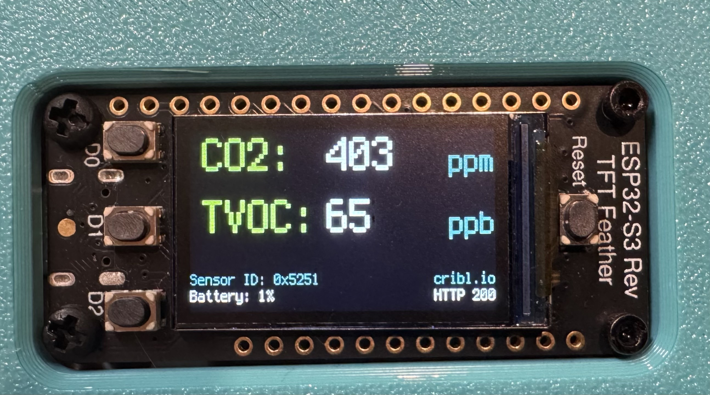

# air-quality


## TL;DR
 - [Overview](https://github.com/berthayes/air-quality/#Overview)
 - [Setup](https://github.com/berthayes/air-quality/#Setup)
 - [The Air Poster Code](https://github.com/berthayes/air-quality/#The-Air-Poster-Code)
 - [Calibration](https://github.com/berthayes/air-quality/#Calibration)
 - [The Calibration Code](https://github.com/berthayes/air-quality/#The-Calibration-Code)
 - [Building the Device and Case](./case/README.md)
 - [Optional: Fart Detector (Recommended)](./fart-detector/README.md)

### Overview
This IoT project uses [Circuitpython](https://circuitpython.org) to read Carbon Dioxide in parts per million (CO2 ppm) and Total Volatile Organic Compounds in parts per billion (TVOC ppb), send them to Cribl Cloud over an HTTP POST. Readings are shown on a cool display. 

The code was developed for and tested on an [Adafruit ESP32-S3 Reverse TFT Feather](https://www.adafruit.com/product/5691) with an [Adafruit SGP30 Air Quality Sensor Breakout](https://www.adafruit.com/product/3709). A calibration script is included to calibrate the sensor.

### Setup
Start with [installing Micropython](https://circuitpython.org/board/adafruit_feather_esp32s3_reverse_tft/) on the board. This will allow the board to act like a removable drive with a small filesystem. 

Download or clone this repository. With the board plugged in, copy the `lib/` directory and the python scripts to it:
```
cd air-quality
cp -av lib/* /Volumes/CIRCUITPYTHON/lib/
cp air_poster_battery_display.py /Volumes/CIRCUITPYTHON/
cp calibrate_sgp30_batttery_display.py /Volumes/CIRCUITPYTHON/
cp air_poster_battery_display.py /Volumes/CIRCUITPYTHON/
cp settings.toml /Volumes/CIRCUITPYTHON/
``` 

Edit the `settings.toml` file to include your WiFi credentials and Cloud endpoint.

Circuitpython will automatically run the `code.py` file when it starts up. So, to calibrate the device, copy the calibration script to `code.py`.
```
cp air-quality/calibrate_sgp30_batttery_display.py /Volumes/CIRCUITPY/
```
### The Air Poster Code
The `air_poster_battery_display.py` does the following:
 - At startup: contact [worldtimeapi.org](https://worldtimeapi.org) to get an epoch timestamp. This gets reported as boot time to track how long a sensor has been online (the readings can drift after a while)
 - Every second: 
    - Take a reading of Carbon Dioxide (CO2) and Total Volatile Organic Compounds (TVOC)
    - Create a JSON object with air-quality readings, board ID, sensor ID, baseline values (for calibration) and boot time.
    - Push the JSON object to the Cloud via HTTP POST
    - Update the display with the new readings and the HTTP code from the POST and battery status.


### Calibration
You've got to calibrate these SGP30s or else ~~they'll rust up on ya~~ you won't get accurate readings.
See page 12 from the [Adafruit Guide](https://cdn-learn.adafruit.com/downloads/pdf/adafruit-sgp30-gas-tvoc-eco2-mox-sensor.pdf) which quotes the manufacturer:
>If no stored baseline is available after initializing the baseline algorithm,
the sensor has to run for 12 hours until the baseline can be stored. This will
ensure an optimal behavior for the next time it starts up. Reading out the
baseline prior should be avoided unless a valid baseline is restored first.
Once the baseline is properly initialized or restored, the current baseline
value should be stored approximately once per hour. While the sensor is
off, baseline values are valid for a maximum of seven days.

TL;DR - you need to run the calibration script for 12 hours the first time you boot the device, or the first time you run the device after it's been powered off for 7 days or longer.


### The Calibration Code
Oh look: a rabbit hole! Out of the box, the air sensor is good enough to track rising/falling trends in concentration, but calibration is required to ensure accuracy.

The calibration script does the following:
 - At startup: 
    - Initialize the calibration routine on the sensor
    - Contact [worldtimeapi.org](https://worldtimeapi.org) to get an epoch timestamp.
 - Every 5 minutes:
    - Get the epoch timestamp again to track uptime (sensor should run for 12 hours or 720 minutes to fully calibrate).
    - Get baseline CO2 and TVOC values (used in calibration)
    - Get the adjusted CO2 and TVOC values (reported in ppm or ppb)
    - Create a JSON object with air-quality readings, board ID, sensor ID, baseline values, boot time, and uptime. 
    - Push the JSON object to the Cloud via HTTP POST
- Every 1 second:
    - Get baseline CO2 and TVOC values (used in calibration)
    - Get the adjucsted CO2 and TVOC values (reported in ppm or ppb)    
    - Update the display with new values
    - Update the display with battery status
    - Update the display with the number of seconds remaining until next HTTP POST


### Building Device and Case
STL files and parts list are included in the [case/README](./case/README.md) file.

