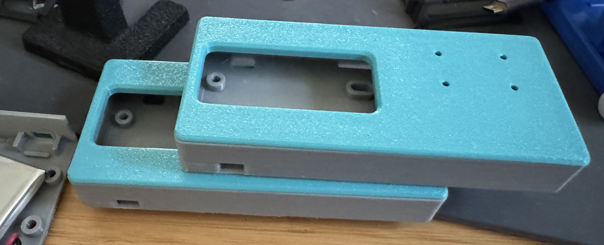
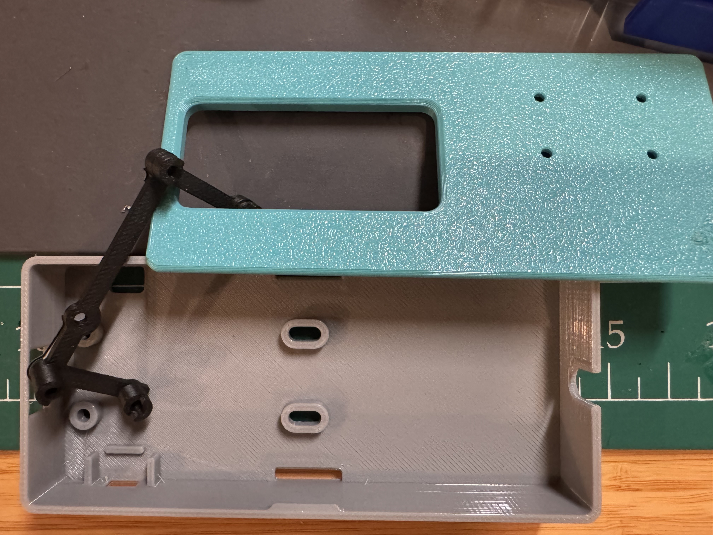
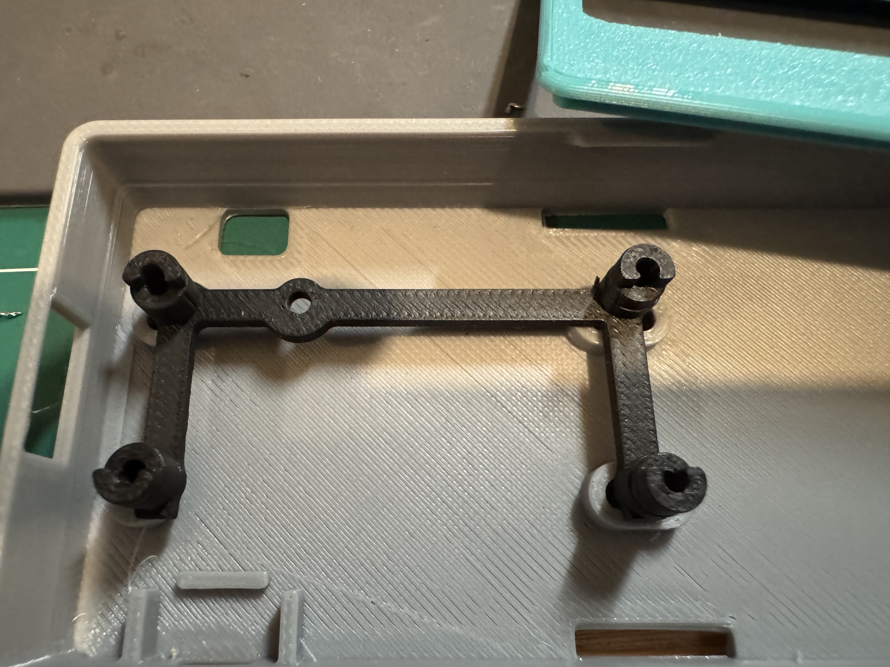
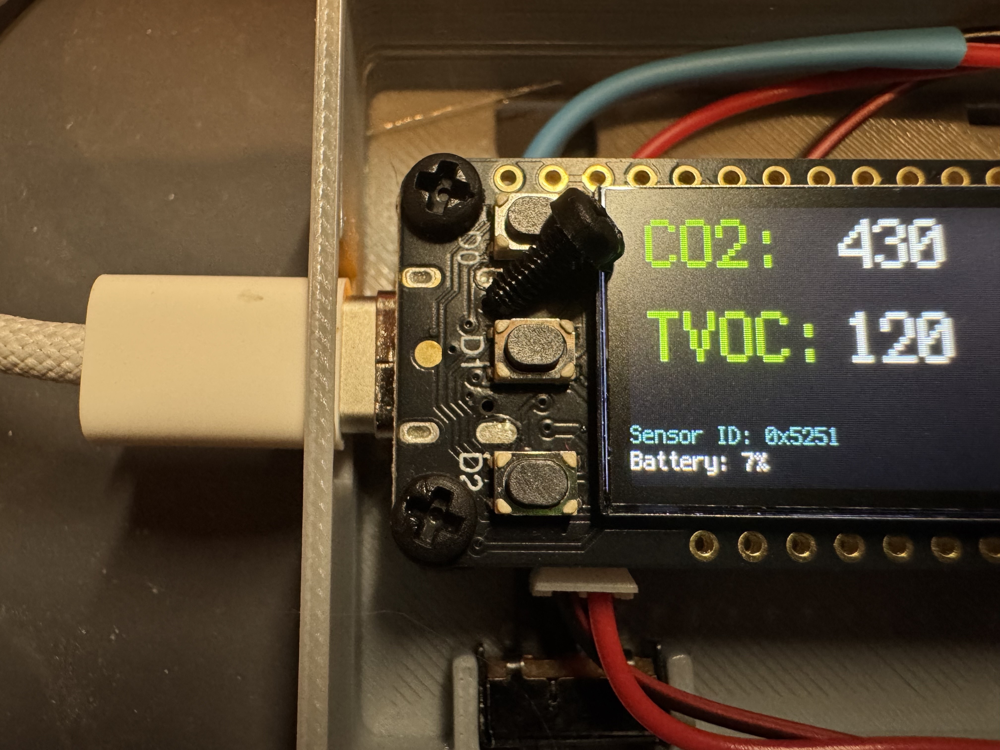
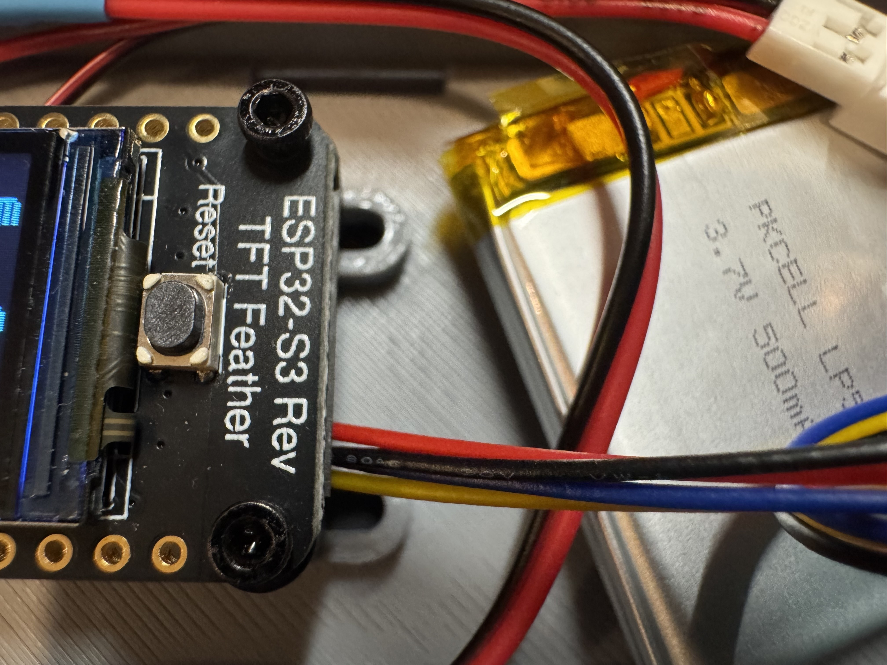
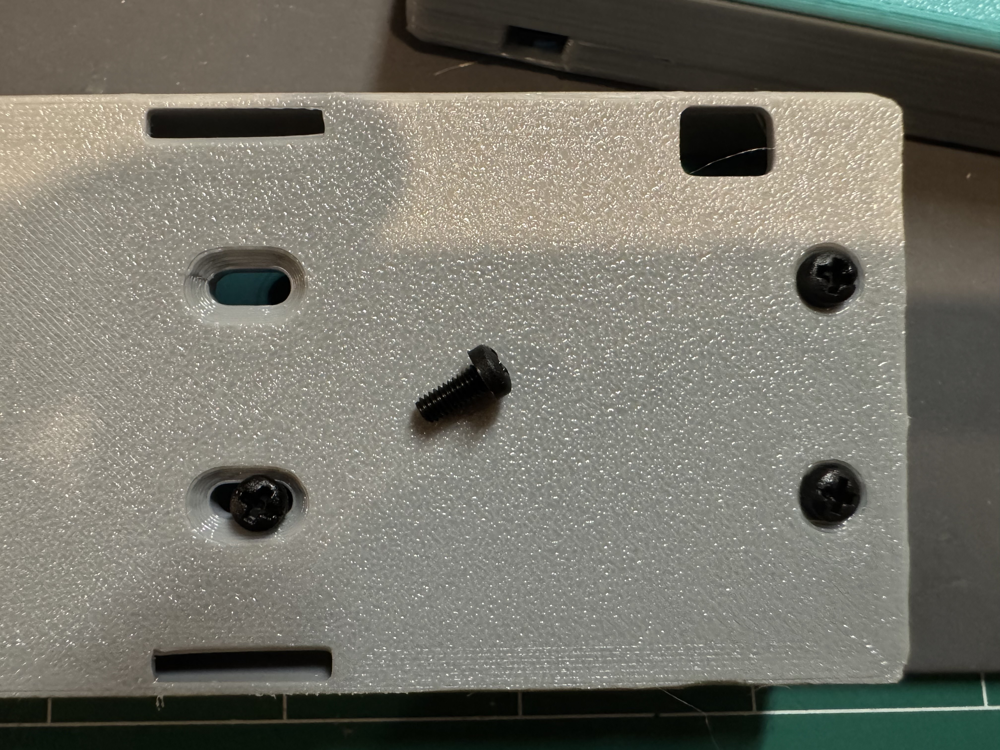
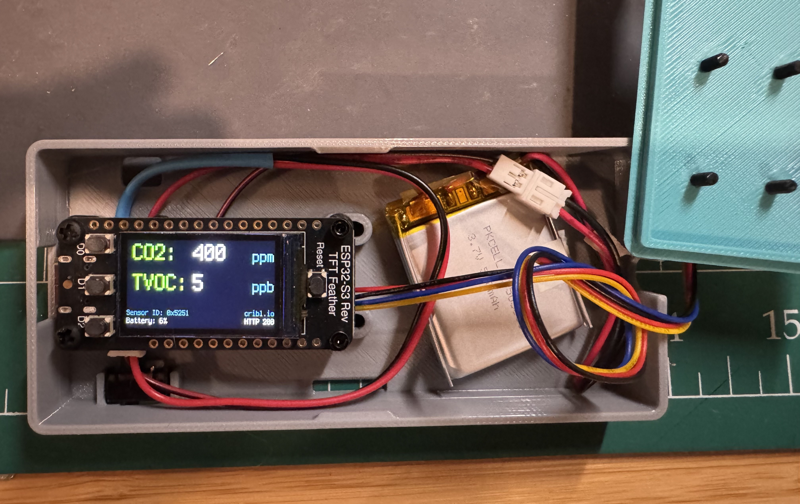
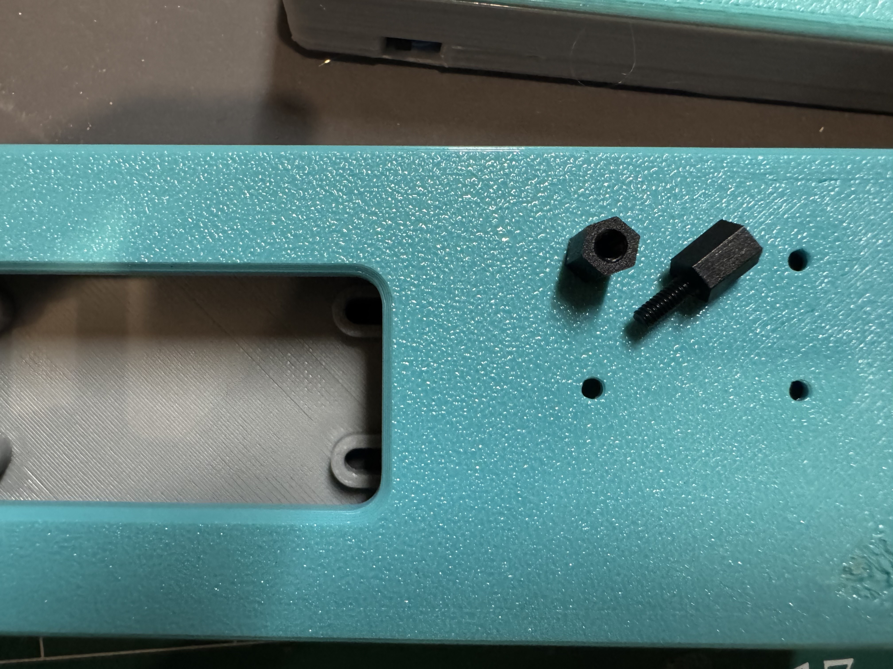
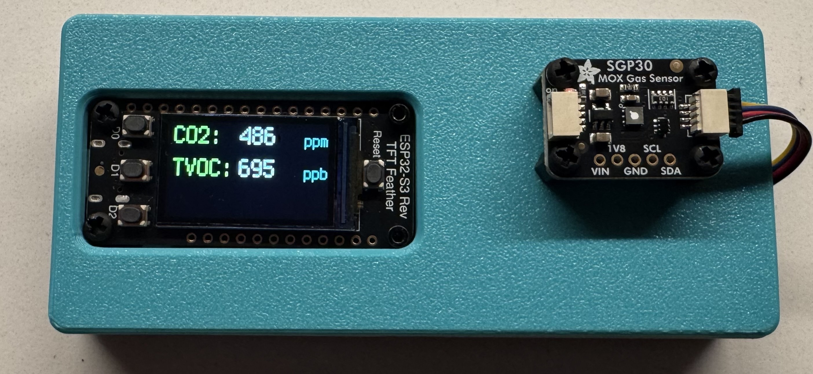

# The Hardware

## Parts List

The IoT *thing* itself is pretty straightforward and all of the parts used for this build can be purchased online from [Adafruit](https://adafruit.com). The IoT microcontroller is an ESP32-S3 with a nifty display and the sensor is an SGP30. They talk to each other using the I2C protocol; each one has a JST SH 4-pin connector so no soldering is required if using an Adafruit STEMMA cable (or Sparkfun Qwiic cable, etc.) 

If you're going to use the 3D printed case, you'll want to create a [battery on/off switch](https://learn.adafruit.com/on-slash-off-switches). This *will* require soldering but is pretty easy.

- Adafruit ESP32-S3 Reverse TFT Feather - 4MB Flash, 2MB PSRAM, STEMMA QT
    - https://www.adafruit.com/product/5691
    - ESP32-S3 with built-in 240x135 color TFT display and Qwiic/Stemma (I2C) connector
    - $24.95
- Adafruit SGP30 Air Quality Sensor Breakout - VOC and eCO2 - STEMMA QT / Qwiic
    - https://www.adafruit.com/product/3709
    - You'll want to calibrate this for best results (see sample code)
    - $17.50
- Lithium Ion Polymer Battery - 3.7v 500mAh
    - https://www.adafruit.com/product/1578
    - $7.95
- STEMMA QT / Qwiic JST SH 4-Pin Cable - 200mm Long
    - https://www.adafruit.com/product/4401
    - $1.25
- Black Nylon Machine Screw and Stand-off Set – M2.5 Thread
    - https://www.adafruit.com/product/3299
    - More than you'll need until you buy them again
    - $16.95
- Breadboard-friendly SPDT Slide Switch
    - https://www.adafruit.com/product/805
    - This should fit snugly in the 3d printed case.
    - $0.95

## 3D Printed Case
For designing the case for this build, I took some existing designs from the folks at Adafruit and hacked away. The case is based on the [3D Printed Case for Adafruit Feather](https://learn.adafruit.com/3d-printed-case-for-adafruit-feather/cad) by Ruiz Brothers with modifications for the placement of the USB cable and overall length of the case. There is a mounting bracket for the feather and case which is also based on a design by Ruiz Brothers for an [air-quality monitoring project](https://learn.adafruit.com/aqi-case) that also uses this board.

This feather is built differently from other Adafruit feathers and won't fit in the standard case. This modified case includes a slightly higher hole for a USB cable and uses a small stand to raise the board and allow room for the connectors on its underside.

## To assemble
Use 2 x M2.5x6mm Nylon screws to fasten the end of the feather with the USB connection to the feather stand. (Although this image shows the stand in the case, don't put it in there yet.)

Use 2 x M2x6mm Hex head machine screws to fasten the other end of the feather to the stand.

Attach the I2C (Qwiic, Stemma) cable to the underside of the Feather. Plug one end of the [battery on/off switch](https://learn.adafruit.com/on-slash-off-switches) into the board and the battery into the other end. Hold the battery switch in place in the case using a little spot of poster putty or ABC gum. Plug the battery in and use some gum/putty to stick it to the bottom of the case. 

Screw the bottom of the case to the underside of the feather stand using 4 x M2.5x6mm nylon screws.

Pull the I2C cable out through the keyhole opening at the end of the case. If you use a 200mm cable, tie a small knot in it to take up some slack.

Take 4 of the M2.5x6mm M-F hex standoff and screw them directly into the 4 holes in the case lid. If they don't screw in snugly, use some M2.5 Hex Nuts on the other side of the lid to hold them in place.

Use 4 of the M2.5x4mm nylon scres to attach the SGP30 sensor breakout board to the standoffs on the lid. 
